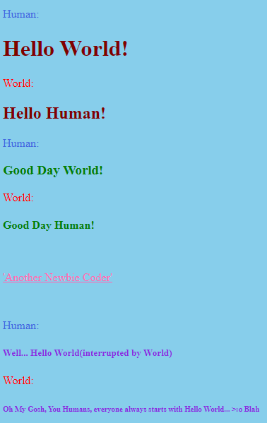
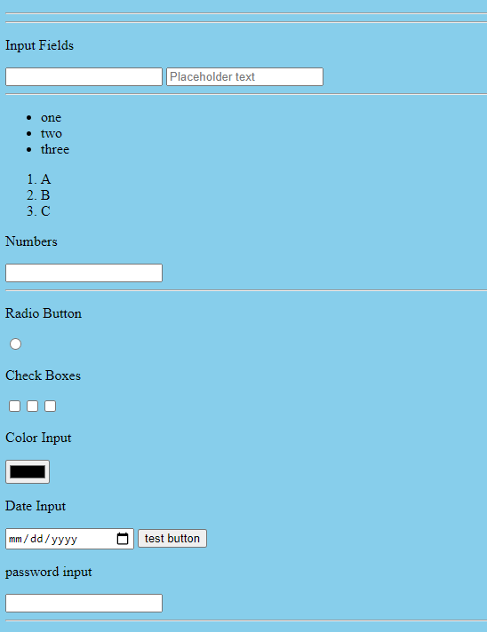
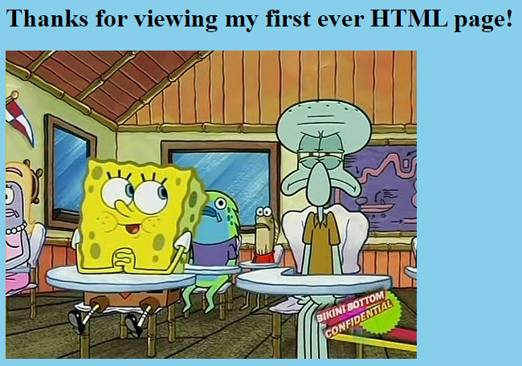

# myHelloWorld

```
In this project I did Three Things: 
    1. Did my First Hello World - with a snip on it
    2. I practiced the Input tag in VS code
    3. Lastly, I was able to bring an image of SpongeBob 
```
## Section 1


>I did a Hello World but with the World Responding back... Go Easy On My Joking Skills.

## Section 2


>In this section I did a bunch of Input Tags to see all of the different Input Tags I could render.

## Section 3


>This section I learnt how to bring in an image and edit the image.


## LINKS

- [Code Refactor Link] Coming Soon!
- [Github Repo Link](https://github.com/nicholasd-uci/myHelloWorld)

- - -
© 2020 NPRD, Nicholas Paul Ruiz Dallas